# Wireframes

The first page when visiting our webpage is the login page. Users can login if they have already made an account, click on "Sign Up" to create an account, or click "Forgot Password" to recover their password. 
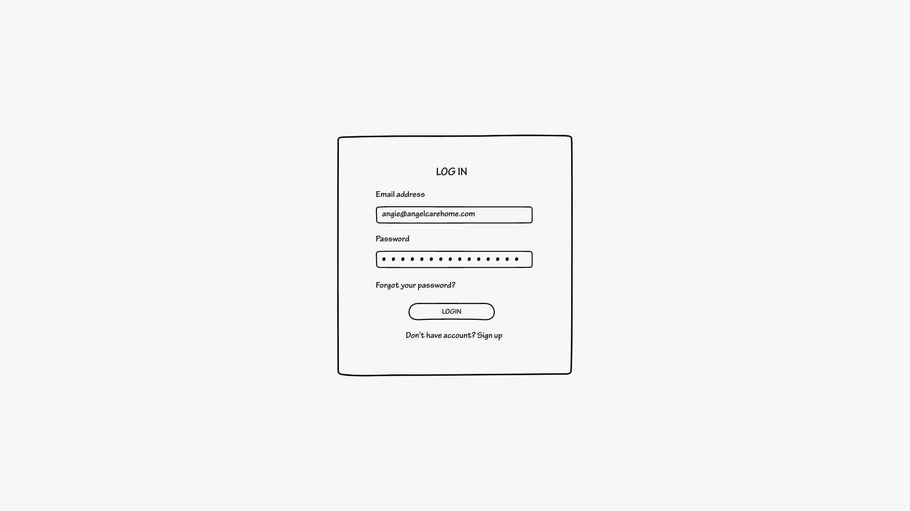

Once a user clicks "Sign Up," they are prompted to this screen where they will input some user information and create an account.
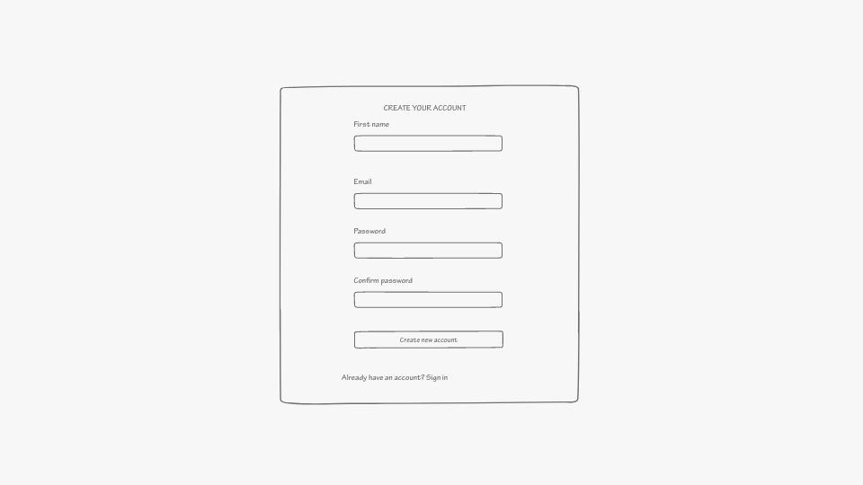

When forgot password is clicked, user enters the email associated with their account and the rest is handled in the user's email.
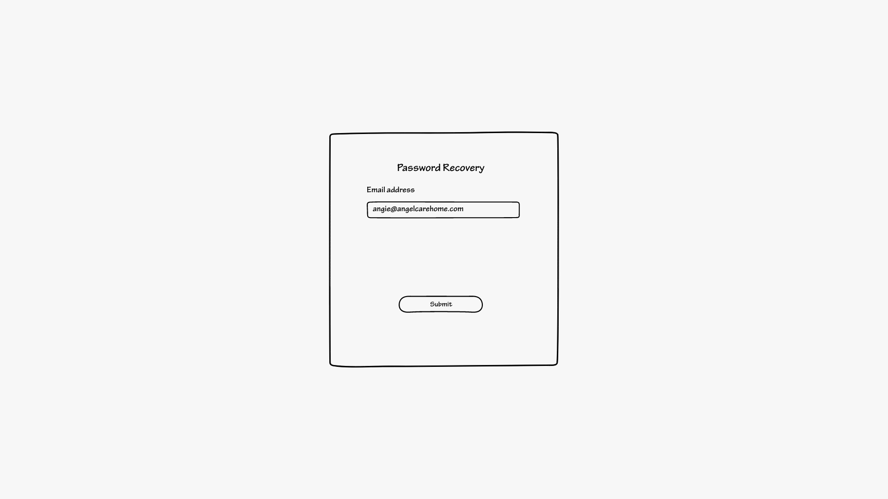
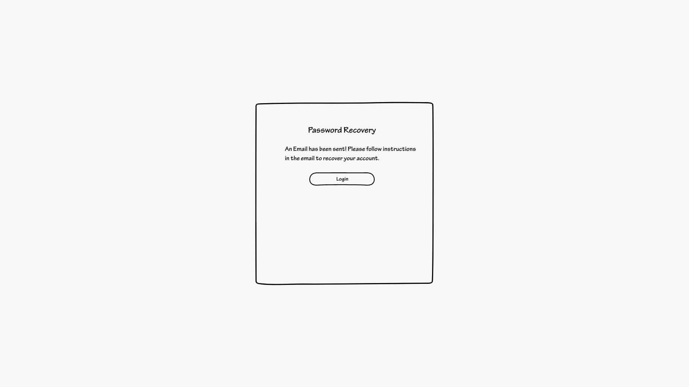

Once a user has logged in, this is the homepage that prompted right after. The homepage has two rows where one row is the new recipes inputted either by the user or the database and the other row is recipes are that are popular that week from our selection. User can click on the recipe and be prompted to another page that shows all the details for that recipe. User can also click the add button to add it to the my recipes page. (Both pages are shown later down).
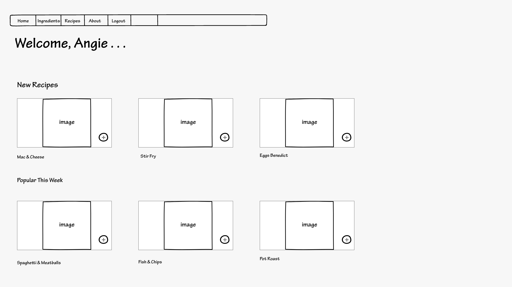

This page shows that food items currently in stock for the user. It gives a list of items with a status of whether it is good,expiring soon, or expired. Each item also has a quantity and price. User can click on add food item button to add more food items.  The checkbox is to indicate if you want to see that item used in a recipe. If the box is checked, in the recipe details page it will tell if that item is in stock and used in that recipe. ** ADD A FORGOT PASSWORD PAGE***
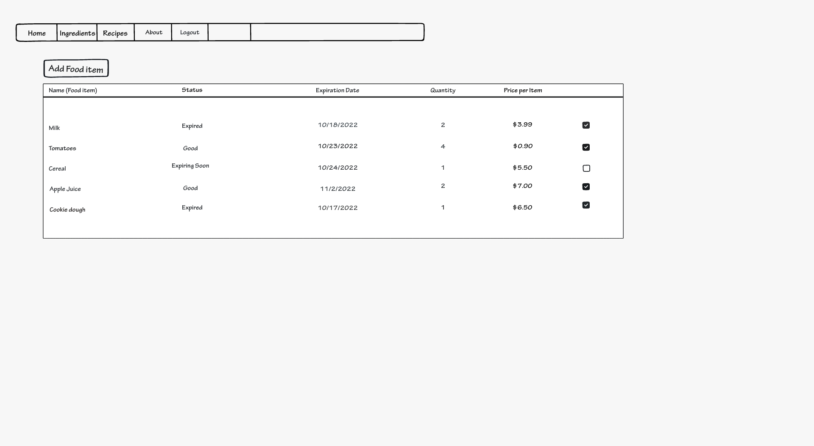

This page allows user to add food items after submitting the necessary information. After clicking add food item, the food item can be seen in the food items table in the second image below. 
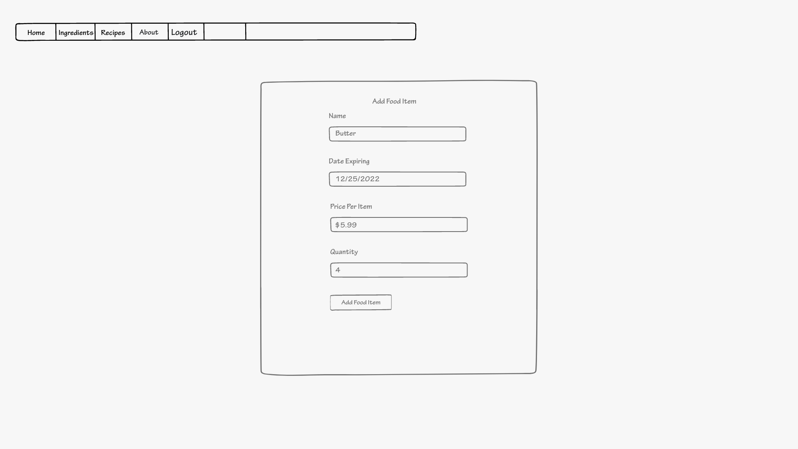
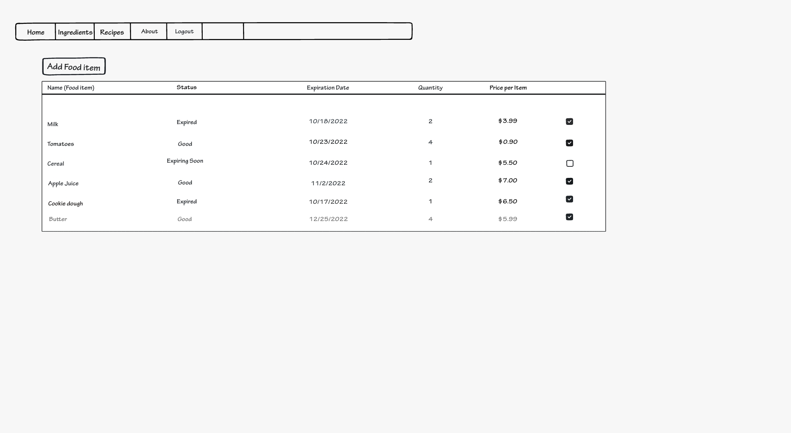

This is the my recipes page that holds the users saved recipes. The user can click on a recipe and will be prompted to another page with more details about that recipe. This is also the page where the recipes added from the homepage will showup. There is also an add recipe button that prompts the user to add a recipe. 
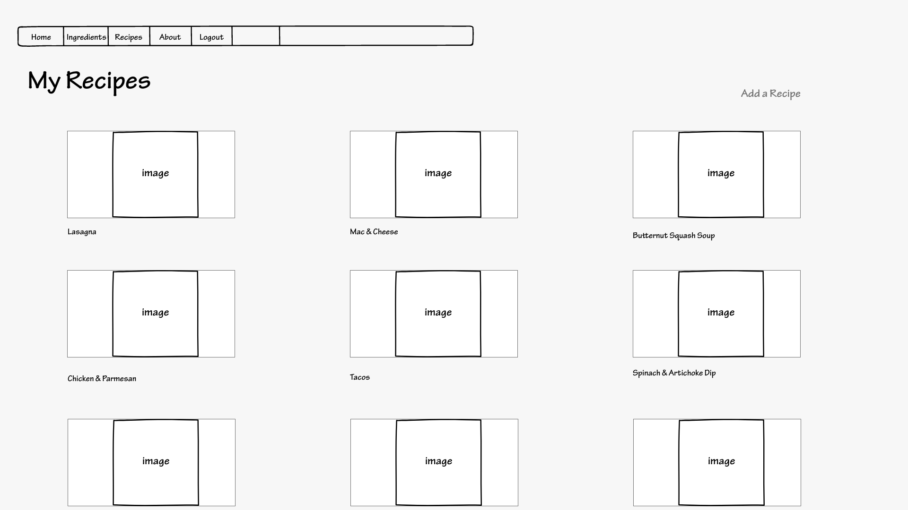

This is the detailed recipe page. This is the page that appears when a recipe is clicked either on the homepage or in the my recipes page. The checkbox by the item butter tells you which item the recipe uses from the checked items you want to use.
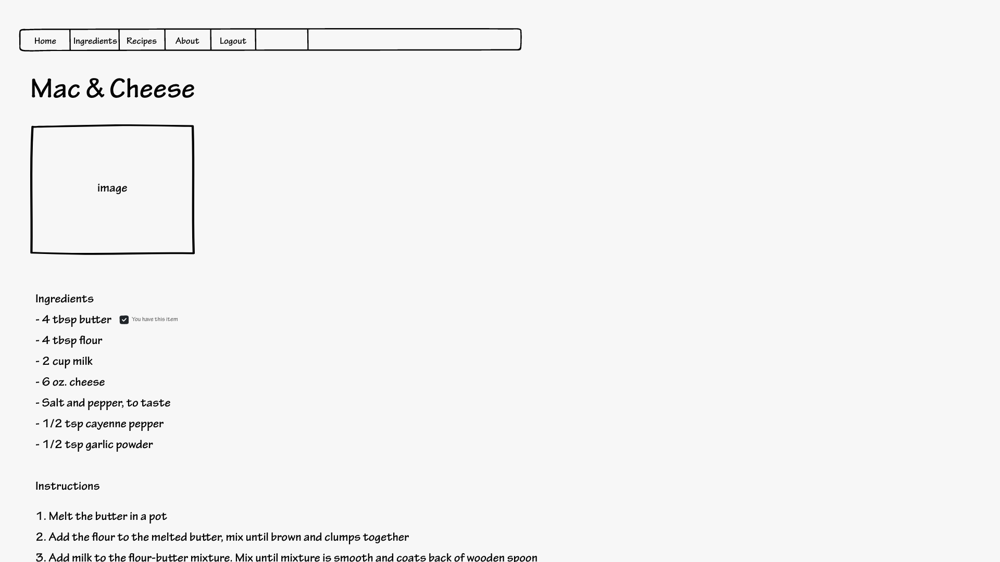

This is the add recipe page that is prompted when user clicks the add a recipe button in my recipes page. User inputs all the information needed and clicks the add recipe button. After that it can be seen in the my recipes page as shown in the second image below. 
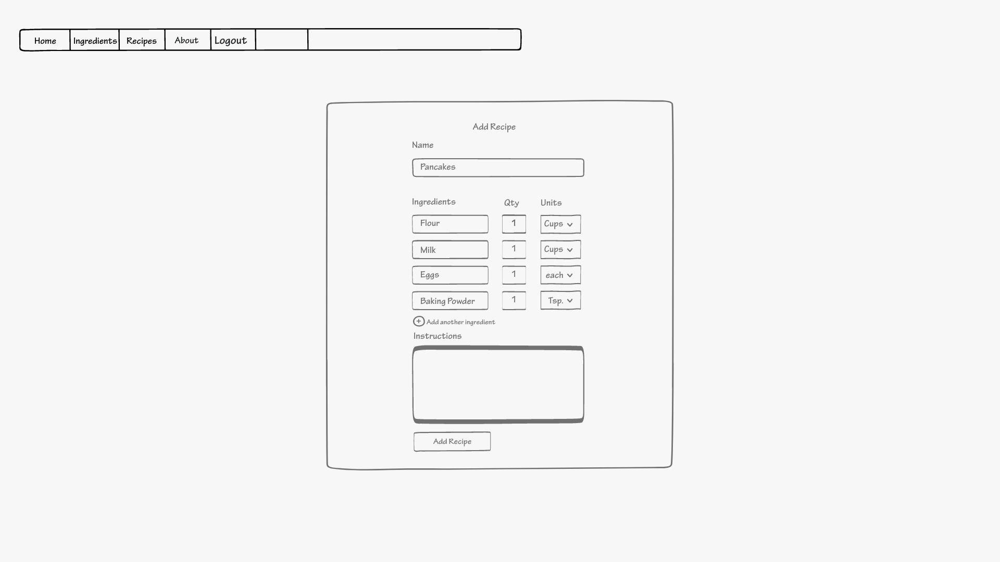
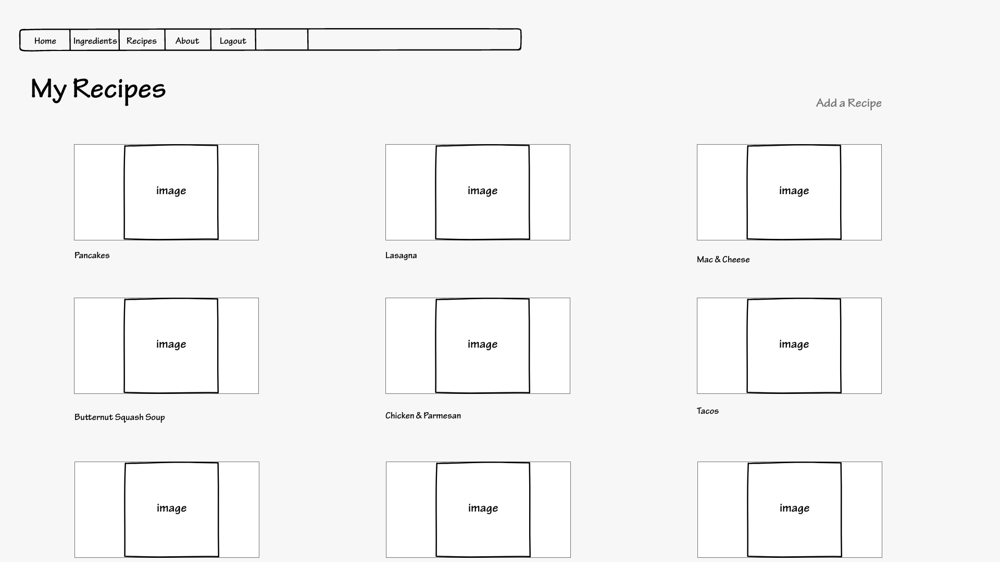

This is the "about us" and "contact us" page where users can learn about more about us and find ways to contact us for any reason. 
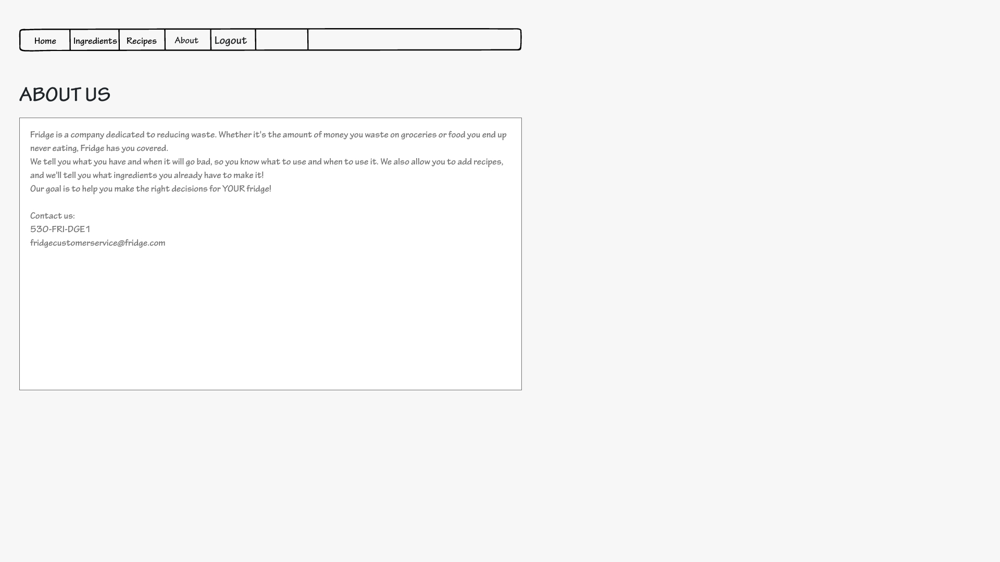
